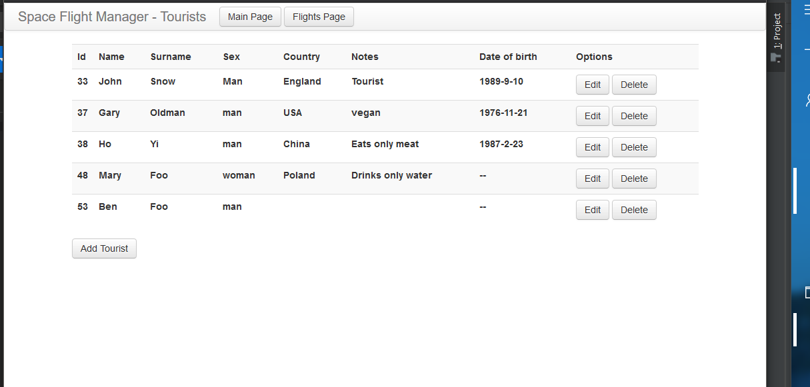
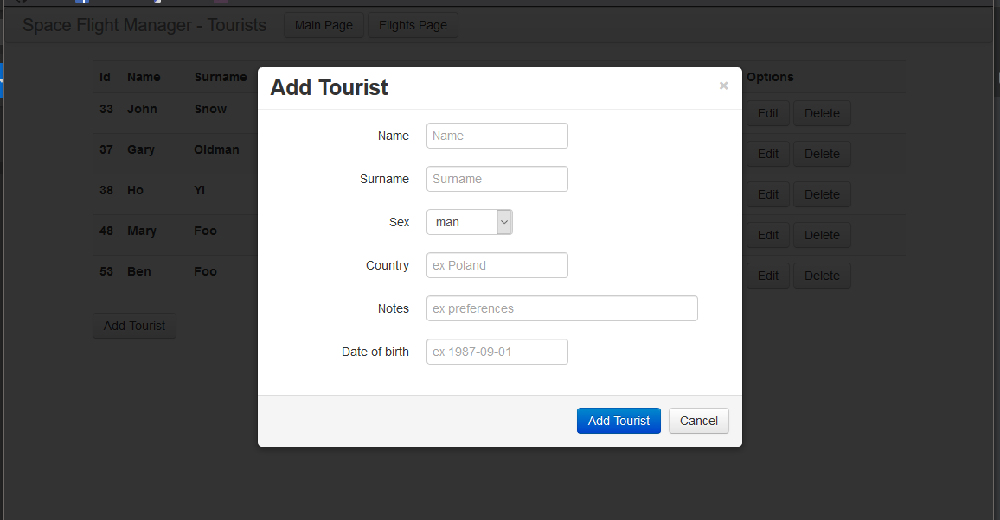
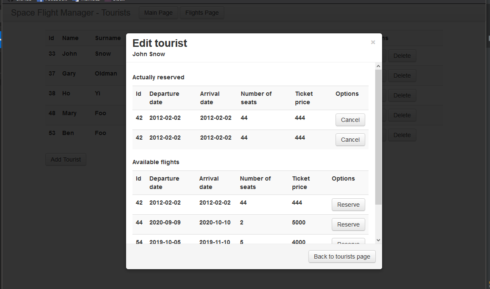
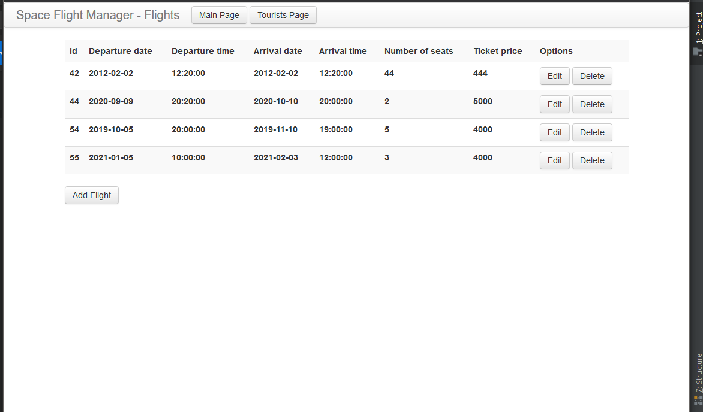
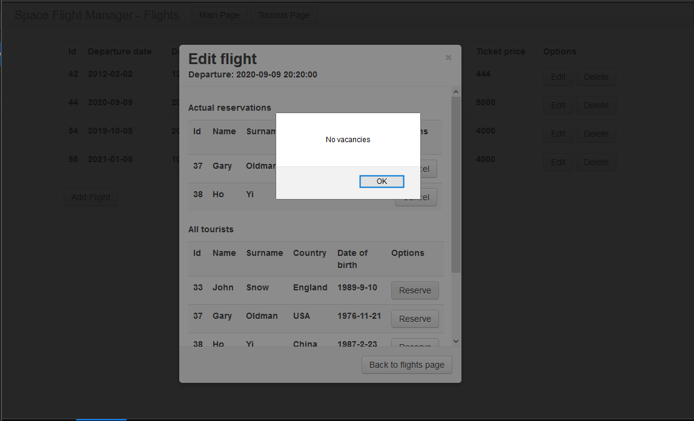

# Space Flight Manager
A small REST project imitating a service to manage space flights.

### Technologies used
#### Back-end:
- Gradle
- Spring Boot
- Spring MVC
- JPA
- Hibernate
- MySQL

#### Front-end:
- JavaScript
- jQuery
- Knockout
- Twitter - Bootstrap
- HTML

### Screenshots

